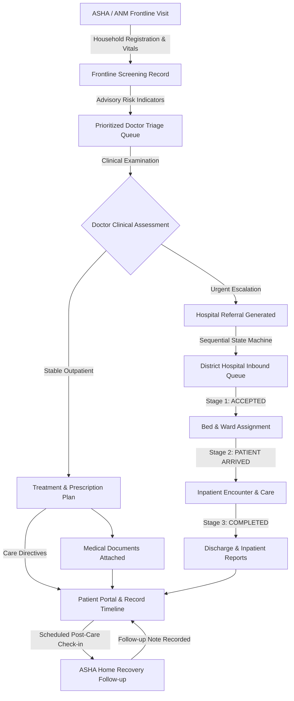
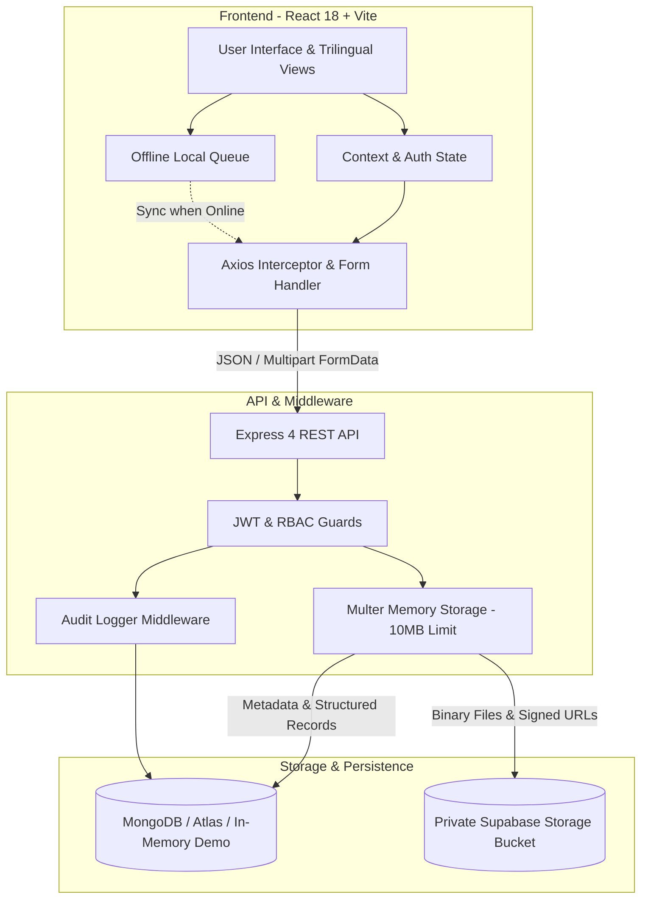

# SwasthyaSetu (स्वास्थ्यसेतु)
> **"One patient. One connected healthcare journey."**

[](https://www.sih.gov.in/)
[](#team--acknowledgements)
[](#project-status)
[](https://swasthyasetu-eta.vercel.app)
[](https://swasthyasetu-pqq4.onrender.com)
[](LICENSE)

SwasthyaSetu is a rural healthcare coordination platform developed for **Smart India Hackathon 2026** under **Problem Statement PS 26133** (*Accessibility and quality of public healthcare services, particularly in rural and underserved areas*).

It connects **ASHA/ANM frontline workers, qualified doctors, district hospitals, health department administrators, and rural households** into a single continuous care journey—ensuring that frontline screenings lead to authoritative doctor assessments, structured treatments or sequential hospital referrals, secure medical records, and scheduled recovery follow-ups.

---

## 🎥 Project Demo & Live Links

- **YouTube Video Walkthrough**: [Watch Complete Website Demo](https://youtu.be/MBIkcuRsjhM?si=yPE3gHT6oU0tBqg5)  
  *“SwasthyaSetu | Rural Healthcare Journey – Website Demo | SIH 2026 | TEAM LIFELINK”*
- **Live Website**: [https://swasthyasetu-eta.vercel.app](https://swasthyasetu-eta.vercel.app)
- **Backend API**: [https://swasthyasetu-pqq4.onrender.com](https://swasthyasetu-pqq4.onrender.com)
- **GitHub Repository**: [https://github.com/vinit130/SwasthyaSetu](https://github.com/vinit130/SwasthyaSetu)

---

## 📑 Table of Contents

1. [Why This Matters (The Rural Healthcare Challenge)](#why-this-matters)
2. [The Solution & Core Differentiator](#the-solution--key-differentiator)
3. [Core Healthcare Journey](#core-healthcare-journey)
4. [5-Role Coordination System](#5-role-coordination-system)
5. [Doctor Consultation: "Essential First" UX](#doctor-consultation-essential-first-ux)
6. [Medical Document Management](#medical-document-management)
7. [Emergency Break-Glass Access & Referral Tokens](#emergency-break-glass-access--referral-tokens)
8. [Medical Inventory & Ward Bed Management](#medical-inventory--ward-bed-management)
9. [Offline Support for Field Operations](#offline-support-for-field-operations)
10. [Technical Architecture & Data Model](#technical-architecture--data-model)
11. [Security & Privacy Architecture](#security--privacy-architecture)
12. [Testing & Verification Suite](#testing--verification-suite)
13. [Feature Status Matrix](#feature-status-matrix)
14. [Current Limitations](#current-limitations)
15. [Future Scope](#future-scope)
16. [Local Installation & Setup](#local-installation--setup)
17. [Team & Acknowledgements](#team--acknowledgements)

---

## Why This Matters

Public healthcare in rural and underserved areas faces severe systemic bottlenecks:

- **Fragmented Records Across Tiers**: A patient's frontline screening at a village Sub-Centre/Anganwadi is rarely accessible when they reach a Primary Health Centre (PHC), Community Health Centre (CHC), or District Hospital.
- **Referral Breakdowns**: When rural patients are advised to visit higher facilities, they often travel long distances with only handwritten slips. If paperwork is lost, higher-tier clinicians have zero background context, leading to repetitive diagnostic tests, delayed interventions, or patient dropouts.
- **Frontline Workload & Intermittent Connectivity**: ASHA and ANM workers conduct household visits in remote areas with weak cellular reception, juggling physical registers and repetitive data entry.
- **Information Asymmetry**: Rural patients and their families often leave medical visits without understandable records of their diagnoses, prescribed medications, dosage schedules, or follow-up timelines.

### Complementing Existing Public Health Infrastructure
SwasthyaSetu is designed to **complement** India's expanding digital health ecosystem—including Ayushman Arogya Mandirs (AAM), eSanjeevani teleconsultation, and the Ayushman Bharat Digital Mission (ABDM). While these national initiatives provide vital programs and protocols, SwasthyaSetu addresses the everyday coordination gap at the grass-roots level: ensuring that from the moment an ASHA worker records vitals to the time a hospital completes treatment, the patient's longitudinal journey remains unbroken.

---

## The Solution & Key Differentiator

> **"One patient. One connected healthcare journey."**

Rather than treating healthcare as isolated transactions (a disconnected screening here, an unlinked prescription there), SwasthyaSetu unites the clinical lifecycle:

$$\text{ASHA Frontline Screening} \longrightarrow \text{Doctor Clinical Assessment} \longrightarrow \left[ \begin{array}{c} \text{Treatment / Prescription} \\ \text{OR} \\ \text{Sequential Hospital Referral} \end{array} \right] \longrightarrow \text{Medical Documents} \longrightarrow \text{Follow-up Care}$$

Key principles:
- **Doctor as Clinical Authority**: The platform does not use black-box "AI diagnoses." The qualified doctor performs the clinical assessment and authoritatively assigns triage risk levels; automated tools only provide advisory physiological indicators.
- **Zero Redundant Data Entry**: Context is inherited across screens. Attaching documents or generating referrals never requires re-typing patient IDs, names, or facilities.
- **Trilingual Accessibility**: Full UI support for **English**, **Hindi (हिन्दी)**, and **Marathi (मराठी)** with native Devanagari typography, optimized for high-contrast visibility in outdoor field conditions.

---

## Core Healthcare Journey

The following sequential workflow forms the backbone of SwasthyaSetu:



---

## 5-Role Coordination System

SwasthyaSetu enforces strict Role-Based Access Control (RBAC) across 5 distinct actors:

### 1. ASHA / ANM Frontline Worker (`ASHA`)
- **Household Registration**: Enrolls village residents with demographic details, village name, age, gender, blood group, optional ABHA identifier, and strict 10-digit Indian mobile validation (`/^[6-9]\d{9}$/`).
- **Frontline Vitals & Symptom Screening**: Captures systolic/diastolic blood pressure, heart rate, oxygen saturation (SpO2), temperature, blood glucose, and present symptoms.
- **Advisory Decision Support**: A deterministic physiological rule engine calculates an advisory triage flag (`GREEN`, `YELLOW`, `RED`) to help prioritize doctor reviews. Status remains `PENDING_REVIEW` until a qualified doctor evaluates the patient.
- **Credential Handover**: Provides auto-generated credentials (username and temporary password) so the patient or family can access their care portal.
- **Recovery Follow-ups**: Conducts scheduled post-consultation home visits and records patient recovery progress.
- **Offline Field Mode**: Screenings captured without internet connectivity are queued locally and synchronized automatically upon reconnection.

### 2. Qualified Doctor (`DOCTOR`)
- **Prioritized Triage Queue**: Patients are sorted by clinical urgency, with flagged high-risk cases highlighted for immediate attention.
- **Authoritative Clinical Assessment**: Evaluates observations, confirms the definitive risk level (`LOW RISK / GREEN`, `MODERATE / YELLOW`, or `HIGH RISK / RED`), and issues formal medical notes.
- **"Essential First" Consultation**: Streamlined interface focusing on clinical observations, primary diagnosis, prescription formulation chips, and follow-up timelines.
- **Medical Document Attachment**: Instant document upload or camera capture attached directly to the patient's record without manual form filling.
- **Inter-facility Referrals**: Generates formal referrals to district or tertiary hospitals when specialized inpatient care is required.

### 3. District Hospital Staff (`DISTRICT_HOSPITAL`)
- **Inbound Referral Tracking**: Real-time visibility into incoming referrals from primary care facilities.
- **Sequential Referral State Machine**: Transitions referrals through verifiable stages: `CREATED` $\rightarrow$ `ACCEPTED` $\rightarrow$ `PATIENT ARRIVED` $\rightarrow$ `COMPLETED`.
- **Emergency "Break-Glass" Access**: In urgent life-threatening situations where physical referral tokens are unavailable, authorized clinical staff can query patient records using mobile number or Patient ID. Strictly requires clinical justification and logs an immutable audit trail.
- **Ward Bed Management**: Real-time tracking and status updating (`AVAILABLE`, `OCCUPIED`, `MAINTENANCE`) across General, ICU, Maternity, and Pediatric wards.
- **Inpatient Encounter Documentation**: Records admission notes, diagnosis, procedures, and clinical discharge summaries.

### 4. Patient / Household (`PATIENT`)
- **Longitudinal Care Journey**: Jargon-free, visual timeline showing registration, frontline visits, doctor consultations, prescriptions, referral transfers, hospital stays, and follow-up dates.
- **Prescriptions & Instructions**: Direct visibility into prescribed medications, dosages, and doctor advice.
- **Personal Document Access**: Securely views attached medical files, lab reports, and imaging documents.
- **Strict Data Isolation**: Enforced by backend authorization guards; patients can only query and view their own verified records.

### 5. Health Department Administrator (`HEALTH_DEPARTMENT_ADMIN`)
- **Statewide / District Overview**: High-level visibility into aggregate registered patients, monitored facilities, and district-wide bed occupancy.
- **Public Health Surveillance Analytics**: Automated syndromic disease clustering (e.g. detecting acute respiratory infection spikes or gastroenteritis clusters across geographic blocks) to assist public health authorities with timely outbreak response.

---

## Doctor Consultation: "Essential First" UX

To minimize doctor administrative burden during high-volume outpatient clinics, the consultation screen is structured with an **"Essential First"** design pattern and progressive disclosure:

1. **Patient Summary Card (Read-Only)**: Displays patient identity, age, gender, blood group, known drug allergies, and frontline vitals recorded by the ASHA worker.
2. **Essential Clinical Assessment**:
   - Clinical observations textarea with high-frequency quick chips (*Normal chest sounds, Bilateral wheezing, Febrile, etc.*).
   - **Doctor-Confirmed Risk Level**: 3 high-contrast triage buttons:
     - 🟢 **LOW RISK (GREEN)**: Stable outpatient care
     - 🟡 **MODERATE (YELLOW)**: Active follow-up required
     - 🔴 **HIGH RISK (RED)**: Urgent hospital intervention
   - Primary diagnosis with standard ICD-aligned clinical chips (*Viral URI, Acute Bronchitis, Hypertension, etc.*).
3. **Essential Treatment & Follow-up**:
   - Prescription directives with standard rural formulation chips (*Tab Paracetamol 500mg, Tab Cetirizine 10mg, ORS sachet, etc.*).
   - Follow-up timeline with one-tap interval chips (**[ +3 Days ]**, **[ +5 Days ]**, **[ +7 Days ]**, **[ +14 Days ]**) that calculate the target date automatically.
4. **Medical Documents**: Instant one-tap attachment workflow.
5. **Progressive Disclosure: `[ + Add More ]` (Optional)**:
   - Expandable section for differential diagnoses, extended systemic findings, lifestyle/home care advice, and hospital referral directives.
6. **Save & Issue Consultation**: Single action button; interactive document/camera modals are isolated outside the consultation form to prevent accidental submission.

---

## Medical Document Management

SwasthyaSetu incorporates a hardened document attachment system designed for real-world rural clinic conditions:

- **Simple Attachment UX**: 
  - Works like a simple file attachment: the system already knows the active patient context.
  - **Only the file is required**. Document title is completely optional (auto-derived from clean original filename if omitted, e.g. `chest_xray_scan.jpg` $\rightarrow$ `"chest xray scan"`).
  - Document category defaults to `'OTHER'`; notes are optional.
- **Camera & File Selection**:
  - Direct smartphone camera capture (`capture="environment"`) or PDF/image file picker.
  - Instant high-contrast preview card displaying thumbnail/PDF icon, filename, formatted size, and ready status.
  - Action buttons: **[ 🔄 Retake ]**, **[ 📁 Choose Another ]**, and **[ ✕ Clear ]**.
- **Upload Hardening**:
  - Multipart `FormData` streaming via `multer` memory storage.
  - Strict **10 MB size limit** with user-friendly error handling for oversized files.
  - Automatic boundary computation: Axios request interceptor removes default `Content-Type: application/json` on `FormData` instances, preventing header collision.
  - Path traversal sanitization prevents malicious file path naming.
- **Dual-Tier Storage Architecture**:
  - **Private Supabase Storage**: When configured with `SUPABASE_URL` and `SUPABASE_SERVICE_ROLE_KEY`, files are streamed into a private bucket (`medical-documents`). Large binary payloads are dropped from MongoDB, storing only metadata and secure storage paths. Authorized viewing is governed via time-limited signed URLs.
  - **Portable Local Fallback**: When remote storage is unconfigured, the system persists data locally, ensuring uninterrupted functionality during demonstrations and offline development.

---

## Emergency Break-Glass Access & Referral Tokens

In emergency situations, clinical continuity cannot wait for lost paperwork:

- **Opaque Referral Tokens (`SS-REF-2026-XXXXXX`)**:
  - When a doctor creates a referral, the platform issues a cryptographically random, opaque reference token.
  - **Zero Clinical Data in QR Codes**: Referral QR codes contain only this opaque identifier. No sensitive health records, diagnoses, or personal health information are encoded in plain text.
- **Emergency "Break-Glass" Access**:
  - When an unconscious or emergency patient arrives at a district hospital without a referral slip or family member, authorized hospital staff can search by phone number or Patient ID.
  - Access requires an explicit, mandatory clinical justification reason.
  - Every break-glass lookup creates an immutable entry in the `AuditLog` collection, recording:
    - User ID and staff name
    - Role (`DISTRICT_HOSPITAL`)
    - Facility name
    - Timestamp
    - Specific clinical emergency justification entered by the provider

---

## Medical Inventory & Ward Bed Management

SwasthyaSetu includes facility-level tracking to improve resource visibility across rural health institutions:

### Medical Inventory Tracking
- Real-time stock levels, unit types (tablets, vials, strips), batch numbers, and reorder levels.
- Immutable stock movement logging: records transactions as `RECEIVED`, `DISPENSED`, `TRANSFERRED`, or `DISCARDED` with timestamps and responsible staff.
- Expiry date monitoring with visual status alerts (`IN_STOCK`, `LOW_STOCK`, `OUT_OF_STOCK`, `EXPIRED`).
- *Note: This module provides operational inventory visibility and auditability; it does not claim autonomous predictive replenishment.*

### Ward Bed Management
- Tracks bed availability across public health facilities.
- Categorized by ward types: General Ward, ICU, Maternity Ward, and Pediatric Care.
- Real-time status toggling: `AVAILABLE`, `OCCUPIED`, and `MAINTENANCE`.

---

## Offline Support for Field Operations

In remote villages where internet connectivity is intermittent, frontline workers cannot be blocked by network failures:

- **Local Transaction Caching**:
  - Frontline patient registrations and screening visits can be performed completely offline.
  - Data is safely queued in browser `localStorage` with temporary identifiers.
- **Automatic Background Synchronization**:
  - The client monitors network status via `window.addEventListener('online')`.
  - When connectivity returns, pending records are synchronized with the backend. Temporary IDs are reconciled with server-generated database IDs.
- **Engineering Scope Note**: The current offline implementation is a browser-storage prototype focused on frontline screening resilience. A full-scale national deployment would require an offline-first mobile architecture (such as SQLite/WatermelonDB) with conflict-free replicated data types (CRDTs).

---

## Technical Architecture & Data Model

### Architecture Diagram



### Technology Stack
- **Frontend**: React 18.3, Vite 5.4, Tailwind CSS 3.4, Lucide React icons, React Router DOM 6.26, Axios.
- **Backend**: Node.js 20+, Express 4.19, Multer 1.4, JWT (`jsonwebtoken` 9.0), Password Hashing (`bcryptjs` 2.4), Mongoose 8.5.
- **Data & File Storage**: MongoDB (production database) / In-Memory Demo Store (development & test mode) + Supabase Storage (private S3-compatible bucket `medical-documents`).
- **Deployment**: Vercel (Frontend CI/CD), Render (Backend Web Service).

### Database Data Models (13 Collections)
Audited directly from [`server/models/`](file:///c:/Users/rajvi/OneDrive/Desktop/SwasthyaSetu/server/models):

| Model | Purpose |
|---|---|
| `User` | Authentication, hashed credentials, 5 roles, language preference (`en`, `hi`, `mr`), facility assignment. |
| `Patient` | Patient demographics, unique Patient ID (`SS-2026-XXXX`), phone, village, blood group, allergies, optional ABHA. |
| `Visit` | Frontline screening records, vital signs, symptoms, advisory risk indicators, visit review status. |
| `Consultation` | Doctor clinical evaluations, confirmed risk level, observations, diagnosis, prescriptions, follow-up timeline. |
| `Referral` | Inter-facility referrals, sequential lifecycle status (`CREATED`, `ACCEPTED`, `ARRIVED`, `COMPLETED`), target facility. |
| `Followup` | Post-care recovery check-ins, scheduled visit date, ASHA completion notes, recovery status. |
| `MedicalDocument` | Document metadata, file size, MIME type, private storage path, upload source, audit details. |
| `HospitalEncounter` | Inpatient hospital admissions, admission reasons, clinical treatments, discharge summaries. |
| `Facility` | Public health directory (PHCs, CHCs, Sub-Divisional, District Hospitals), geolocation coordinates. |
| `Bed` | Bed inventories, ward classification (ICU, General, etc.), current occupancy status. |
| `InventoryItem` | Pharmaceutical and supply stock quantities, reorder thresholds, batch numbers, expiry dates. |
| `InventoryMovement` | Immutable inventory audit trail tracking restocks, dispenses, transfers, and disposals. |
| `AuditLog` | Security audit trail recording user actions, emergency break-glass lookups, and clinical justifications. |

---

## Security & Privacy Architecture

- **Stateless JWT Authentication**: Secure bearer tokens with configurable expiration (`JWT_EXPIRE`).
- **Password Protection**: Passwords hashed using `bcryptjs` with 10 salt rounds before storage.
- **Strict Role-Based Access Control**: Route-level middleware (`protect`, `authorize`) prevents unauthorized cross-role API access.
- **Patient Record Isolation**: Explicit database queries verify patient ownership; patients cannot query or access records belonging to others (returns `HTTP 403 Forbidden`).
- **Emergency Break-Glass Accountability**: Emergency access is gated by mandatory clinical justification and permanently logged in `AuditLog`.
- **Upload Hardening & Path Sanitization**: File uploads are restricted to 10 MB, validated for permitted MIME types, and filenames are sanitized against directory traversal attacks (`../../../etc/passwd` $\rightarrow$ `passwd`).
- **Opaque Referral References**: Referral tokens and QR codes contain no plain-text clinical data or personal identifiable information.
- **Strict Phone Validation**: Validates 10-digit Indian mobile numbers against `/^[6-9]\d{9}$/`.
- **Zero Secrets in Documentation**: No credentials or private API keys are exposed in documentation or public code.

---

## Testing & Verification Suite

The repository contains automated test suites that rigorously verify core workflows, extended hospital modules, document upload boundaries, and client builds:

### Automated Test Results

| Test Suite | Scope | Result |
|---|---|:---:|
| `node server/utils/verifyWorkflow.js` | 3-role authentication, patient registration, patient isolation, clinical risk confirmation, 4-stage referral state machine, follow-up scheduling, role security guards | **10/10 PASS** |
| `node server/utils/verifyExtended.js` | Health department admin, disease surveillance clustering, hospital inbound referrals, token lookups, break-glass audit logs, bed management, inpatient encounters, inventory movements, 10-digit phone validation, facility geolocation | **11/11 PASS** |
| `node server/utils/testSupabaseDocs.js` | Storage path traversal sanitization, doctor document upload, patient isolation, secure view signed URLs | **4/4 PASS** |
| Multipart Upload Contract Test | Native `FormData` streaming of 546.1 KB JPG pure attachment with zero manual metadata (auto-derived title) | **PASS** (`201 Created`) |
| Oversized File Rejection | Upload of oversized payload (>10 MB) rejected with user-friendly error response | **PASS** (`HTTP 400`) |
| Missing File Validation | Upload request without file payload rejected with prompt to select/capture file | **PASS** (`HTTP 400`) |
| Client Production Build | Vite production compilation (`npm run build --prefix client`) | **PASS** (0 errors, 1681 modules) |
| Live Production Health Probe | Health check and live upload probe against Render backend and Vercel frontend | **PASS** (`200 OK` / `201 Created`) |

### Running the Test Suites Locally

```bash
# Run Core 3-Role Workflow Verification Suite (10 Tests)
node server/utils/verifyWorkflow.js

# Run Extended Modules Verification Suite (11 Tests)
node server/utils/verifyExtended.js

# Run Supabase Storage & Documents Test Suite (4 Tests)
node server/utils/testSupabaseDocs.js
```

---

## Feature Status Matrix

To maintain technical credibility, features are classified according to their actual implementation status:

| Module / Feature | Implementation Status | Notes |
|---|:---:|---|
| **Role-Based Authentication (5 Roles)** | Fully Implemented & Verified | JWT + bcrypt, strict RBAC for ASHA, Doctor, Hospital, Patient, Admin |
| **ASHA Patient Registration & Intake** | Fully Implemented & Verified | Demographics, 10-digit Indian phone validation, credential handover |
| **Frontline Vitals & Symptoms Screening** | Fully Implemented & Verified | Captures BP, SpO2, Pulse, Temp, Glucose; advisory rule-engine indicators |
| **Doctor Clinical Assessment & Triage** | Fully Implemented & Verified | "Essential First" UX, doctor-confirmed risk, observations & diagnosis chips |
| **Treatment & Prescription Planning** | Fully Implemented & Verified | Standard formulation chips, follow-up timeline calculations |
| **Medical Document Attachment** | Fully Implemented & Verified | 10 MB limit, camera scan, instant preview card, auto-derived titles |
| **Private Supabase Document Storage** | Fully Implemented & Verified | Private bucket with signed URLs; portable local fallback if unconfigured |
| **Sequential Referral State Machine** | Fully Implemented & Verified | 4-stage lifecycle (`CREATED` $\rightarrow$ `ACCEPTED` $\rightarrow$ `ARRIVED` $\rightarrow$ `COMPLETED`) |
| **Opaque Referral Token Lookup** | Fully Implemented & Verified | Cryptographic opaque tokens (`SS-REF-2026-XXXXXX`); no clinical data in QR |
| **Emergency Break-Glass Access** | Fully Implemented & Verified | Controlled emergency lookup; mandatory justification + immutable audit log |
| **Ward Bed Management** | Fully Implemented & Verified | Status tracking (`AVAILABLE`, `OCCUPIED`, `MAINTENANCE`) across 4 ward types |
| **Inpatient Hospital Encounters** | Fully Implemented & Verified | Admission notes, inpatient clinical treatments, discharge summaries |
| **Medical Inventory Tracking** | Fully Implemented & Verified | Stock levels, unit tracking, batch tracking, immutable movement logging |
| **Patient Care Journey Portal** | Fully Implemented & Verified | Longitudinal timeline, prescriptions, referral tracking, patient isolation |
| **Public Health Surveillance Analytics** | Fully Implemented & Verified | Syndromic disease clustering (ARI, gastroenteritis) across facility blocks |
| **Trilingual Localization** | Fully Implemented & Verified | English, Hindi (`हिन्दी`), and Marathi (`मराठी`) with Devanagari typography |
| **Offline Screening Mode** | Prototype-Level | Browser `localStorage` queue; automatic synchronization upon reconnection |
| **National ABDM / ABHA Sandbox** | Future Scope | Architectural placeholder field for ABHA ID; live M1/M2/M3 API integration planned |
| **Autonomous AI Diagnostics** | Intentionally Excluded | Clinical ethics: doctors perform assessment; rule engine provides advisory flags only |
| **Native Offline Mobile App** | Future Scope | Mobile application using SQLite/WatermelonDB with CRDT sync planned |

---

## Current Limitations

1. **Working Prototype Deployment**: Built and deployed for demonstration, architectural validation, and evaluation in hackathon settings. Large-scale government deployment would require multi-region cloud clustering and formal security audits.
2. **Deterministic Advisory Indicators**: The physiological screening engine uses standard clinical triage rules to assist prioritization; it is **not** an automated diagnostic engine. Qualified clinicians remain responsible for all medical decisions.
3. **Browser-Based Offline Storage**: Current offline caching relies on web `localStorage`, which is subject to browser cache clearance. Field production requires a native Android application backed by an embedded database.
4. **Demonstration Seed Data**: In the absence of live state health registries, demo facilities, patient journeys, and inventory stocks use structured seed data.
5. **Government Ecosystem Integrations**: ABHA identifiers are recorded as demographic data fields; full live integration with ABDM Milestone 1/2/3 APIs is planned for future phases.

---

## Future Scope

- **ABDM Milestone 1, 2 & 3 Compliance**: Complete sandbox integration with Ayushman Bharat Digital Mission for ABHA creation, verification, and longitudinal health record exchange (HIP/HIU protocols).
- **Native Offline-First Mobile Application**: Dedicated Android app for ASHA workers built with React Native and an embedded SQLite/WatermelonDB database with robust CRDT synchronization.
- **Low-Bandwidth Teleconsultation**: WebRTC-based low-latency audio/video consultations linking rural Sub-Centres and PHCs with District Hospital specialists.
- **Multilingual Voice Dictation**: Speech-to-text integration for Indian regional dialects to enable hands-free clinical note entry during high-volume village screenings.
- **Predictive Inventory & Outbreak Forecasting**: Machine learning models for analyzing seasonal syndromic clusters and optimizing pharmaceutical supply chains against stock-outs.

---

## Local Installation & Setup

### Prerequisites
- [Node.js](https://nodejs.org/) (v18.x or v20.x recommended)
- [npm](https://www.npmjs.com/) (v9.x or higher)
- [MongoDB](https://www.mongodb.com/) (Optional: if not installed, the platform automatically runs in In-Memory Demo Mode)

### Step-by-Step Setup

```bash
# 1. Clone the repository
git clone https://github.com/vinit130/SwasthyaSetu.git
cd SwasthyaSetu

# 2. Configure Environment Variables
cp .env.example .env
# Edit .env to set your JWT_SECRET and (optional) MONGO_URI / SUPABASE keys

# 3. Install All Dependencies (Root, Server & Client)
npm run install:all

# 4. Run Verification Test Suites
npm run test:verify

# 5. Start Unified Production Server (Port 5000)
npm start
```
The application will be accessible at `http://localhost:5000`.

### Running Client Dev Server Separately (Optional)
```bash
# Start backend API (Port 5000)
npm run server

# In a separate terminal, start Vite frontend dev server (Port 5173)
npm run client
```

### Accessing Demo Accounts
Demo credentials for evaluation are available directly on the login screen via **1-Click Quick Login** buttons (or provided separately for review), enabling instant exploration across all roles without manual account creation.

---

## Project Status

**Working Prototype — Deployed for Demonstration & Evaluation**
- **Frontend**: Live on Vercel ([https://swasthyasetu-eta.vercel.app](https://swasthyasetu-eta.vercel.app))
- **Backend**: Live on Render ([https://swasthyasetu-pqq4.onrender.com](https://swasthyasetu-pqq4.onrender.com))
- **Core Workflow Verification**: 10/10 Passed
- **Extended Platform Verification**: 11/11 Passed
- **Supabase Storage & Document Security**: 4/4 Passed
- **Production Build**: 0 errors (1681 modules transformed)

---

## Team & Acknowledgements

Developed with dedication by **TEAM LIFELINK** for **Smart India Hackathon 2026**.

- **Problem Statement**: PS 26133 — Accessibility and quality of public healthcare services, particularly in rural and underserved areas.
- **Ministry / Organization**: Ministry of Health and Family Welfare (MoHFW) / Government of India.

*“Connecting rural healthcare from village screening to hospital recovery.”*
